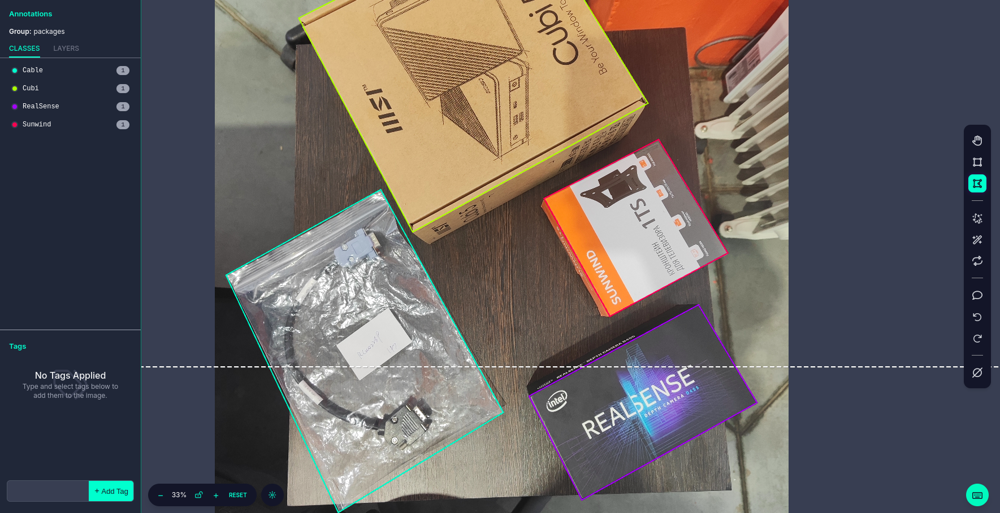
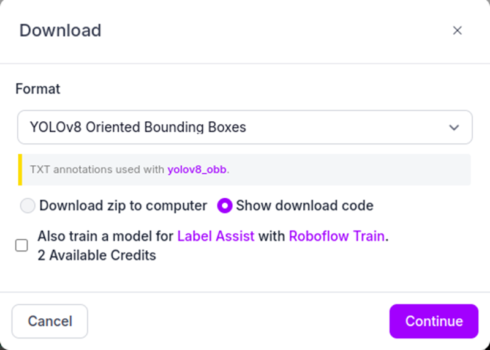
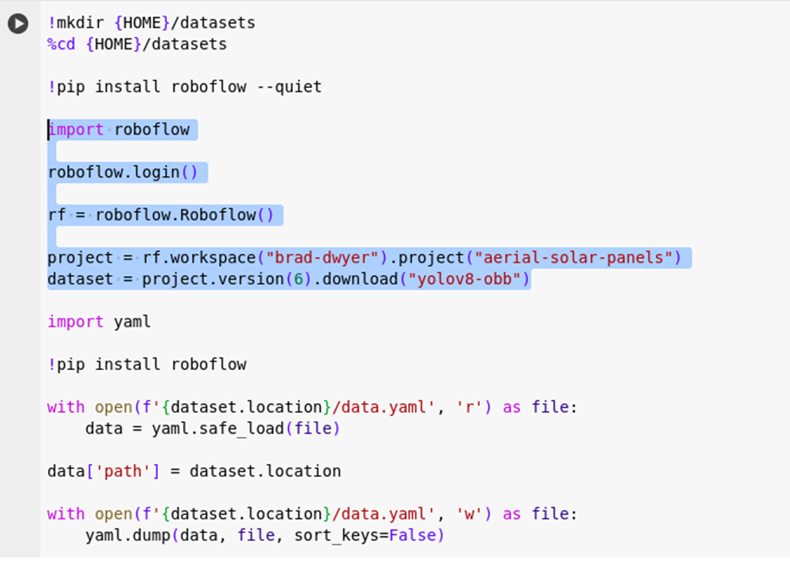
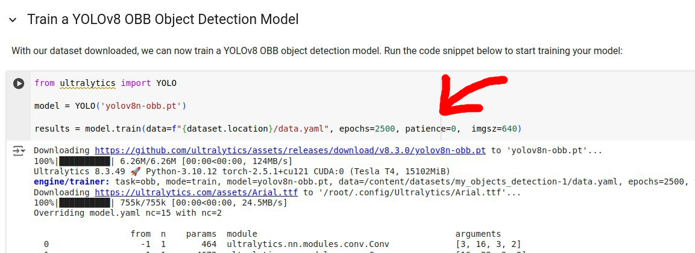
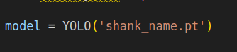

# object-detection-2d

Здесь вы узнаете как с помощью любой камеры обучить модель и решить задачу распознавания 2д объектов

Описанный в данном руководстве алгоритм машинного зрения был протестирован на камере глубины RealSense D455.

Способ распознавания объектов в реальном времени при определении их угловой ориентации на плоскости реализуется с помощью нейронной сети YOLOv8-OBB (Oriented Bounding Boxes). Для этого необходимо выполнить следующие шаги:
1) Подготовить набор фотографий для обучения модели в количестве около 200 rgb изображений на один класс объекта (либо на меньшем количестве фотографий, если объект суммарно встречается на них более 200 раз). Уровень освещения, положение камеры относительно объектов, ***дистанция до объектов***, характер их расположения и ***фон*** должны соответствовать условиям, которые будут воспроизведены при реальном распознавании предметов (ОЧЕНЬ ВАЖНО!)

2) Заведите аккаунт в Roboflow (доступна авторизация через учетную запись Google): https://app.roboflow.com/  После входа под своим логином откроется страница “Projects”.

    В одноименной вкладке будет доступна опция “New project”. Кликните на нее:
     

    В меню “Project type” выберите “Object Detection”. Поля “Project Name” и “Annotation Group” заполните по своему усмотрению, они нужны только для ориентировки среди заготовленных проектов:
    

    После нажатия на иконку “Create Public Project” станет доступна колонка “DATA” в левой части страницы.

    В разделе “Settings” можно добавить/удалить/переименовать классы искомых объектов.

    Перейдите в раздел “Upload Data” – он позволяет загружать в проект изображения из вашего датасета, как по отдельности, так и папкой целиком.

    Теперь необходимо добавить все фотографии, загрузив каждую по отдельности или всю папку целиком:
    

    После добавления всех фотографий (“Save and Continue”) приложение предложит способы их разметки. Нажмите на вариант “Start Manual Labeling”.

    В разделе “Annotate” к разметке загруженных изображений можно перейти через команду “Start Annotating”. Появится интерфейс с инструментарием по выделению объектов; выберите опцию “Polygon Tool”, после чего очертите интересующие объекты четырехугольной рамкой и присвойте им записанные ранее классы. Постарайтесь минимизировать площадь фона в случае, если выделяемый предмет будет не прямоугольной формы. Все размеченные изображения окажутся во вкладке “Annotated”. Нажмите в правом верхнем углу на команду “Add .. images to Dataset”. При переносе изображений в экспортируемый датасет приложение предложит распределить их по категориям “Train-Valid-Test”, без предумышленной надобности не меняйте установленную пропорцию “70%-20%-10%”.

    

    Раздел “Dataset” демонстрирует, в какой из трех категорий находится каждое изображение.
    Раздел “Analytics” показывает статистическую сводку по всем изображениям, включая неаннотированные.
    Раздел “Generate” добавляет насколько шагов по настройке датасета. Рекомендуется обратить внимание на пункт 3 – “Preprocessing”. По умолчанию в нем будут выставлены опции “Resize” и “Auto-Orient”. Для задачи YOLO-OBB они не понадобятся, их можно удалить. В пункте 4 “Augmentation” будет установлен параметр “Grayscale”, переводящий изображения в черно-белый спектр. Его тоже следует отключить, если цвет ваших объектов будет выделяться на фоне. Последний пункт “Create” перепишет размеченный датасет в вид, подходящий для обучения нейросети.
    В разделе “Versions” хранятся подготовленные для данного проекта датасеты. Выберите команду “Custom Train and Upload”, где в высвеченном окне переключите тип модели на “Choose Another Model” и продолжите нажатием “Get Snippet”. В следующем окне перейдите к формату “YOLOv8 Oriented Bounding Boxes”. Продолжив, вы увидите фрагмент кода Jupyter. Его надо скопировать для дальнейшей операции.

    

3) Обучение модели будет проведено в среде Google Colab:
    https://colab.research.google.com/github/roboflow/notebooks/blob/891c41df0b964fe4de001958b773a8643d9b0ac6/notebooks/train-yolov8-obb.ipynb?ref=blog.roboflow.com

    Перед стартом программы запустите процесс “Connect GPU” в правом верхнем углу страницы. Далее активируйте последовательно все блоки скрипта вплоть до шага “Step 5: Export dataset”. В этом сегменте замените выделенные на скриншоте строки скопированной ссылкой из Roboflow.

    
    В следующем фрагменте вы определите количество эпох (итераций), через которые датасет пройдет обучение. Для небольших наборов данных с несколькими классами объектов эта процедура будет длиться в пределах часа, потому для более качественных показателей рекомендуется присвоить параметру epochs значение не менее 1500. Если хотите, чтобы обучение шло непрерывно, передайте в аргументах функции train параметр patience=0:
    

    Завершающая часть кода показывает адрес, по которому будут сохранены веса (результат обучения) модели. Там же указан путь для фото и видеоданных, на которых можно протестировать обученную нейросеть в среде Colab. Папки с вышеперечисленным открываются на панели слева; их содержимое доступно как для скачивания, так и для добавления к ним материалов со своего ПК. Обратите внимание, что при длительном бездействии (10-15 мин) связь с запущенным процессом в Google Colab автоматически прервется и все несохраненные результаты будут утеряны. Общий ресурс подключений GPU за день в Colab ограничен; если ежедневный лимит исчерпается, перезайдите с другой учетной записи Google.

    Сохраненные веса нужно поместить в эту папку. В этой папке помимо инструкции лежит скрипт ob_detection.py. Откройте его и в кавычках следующей строки укажите наименование весов, с помощью которых вы будете проводить object detection:
    
*
    Далее откройте терминал и запустите:
    ***python3 ob_detection***

    Если программа завершилась с ошибкой, то вам потребуется скачать зависимые библиотеки через (sudo pip install <название_библиотеки>).
    После установки библиотек и повторного запуска скрипта все должно заработать!

    При запуске программа выведет окно с трансляцией через RGB-канал камеры. Детектируемые объекты в поле видимости будут очерчены рамками bounding box, над ними будет отражена информация о местоположении объекта относительно точки обзора камеры (координаты X, Y, вместо Z – расстояние до объекта). Дистанция вычисляется от центра bounding box, отмеченного красной точкой. Угловая ориентация рамки определяется в интервале (-90, +90), YOLO-OBB не дифференцирует “верх” и “низ” объектов.

    

